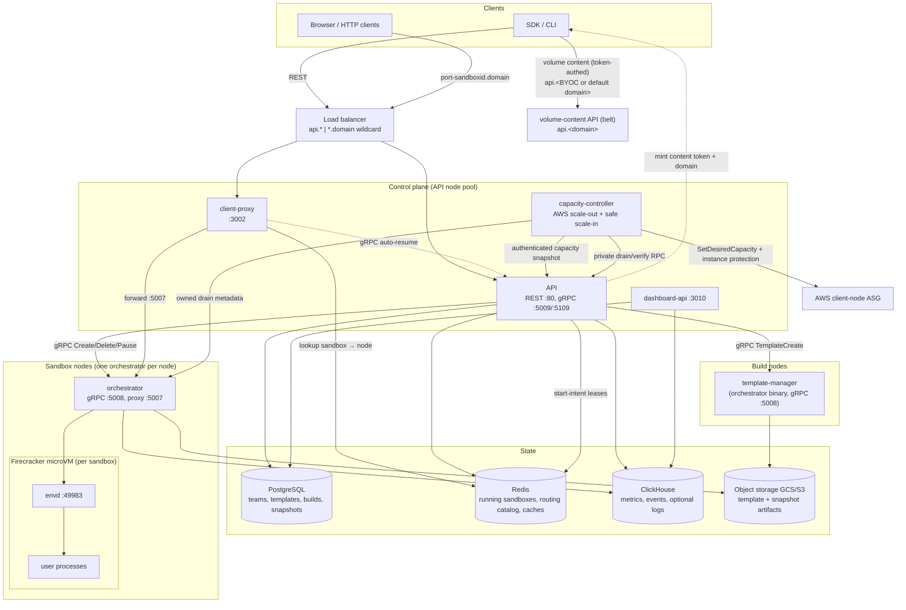
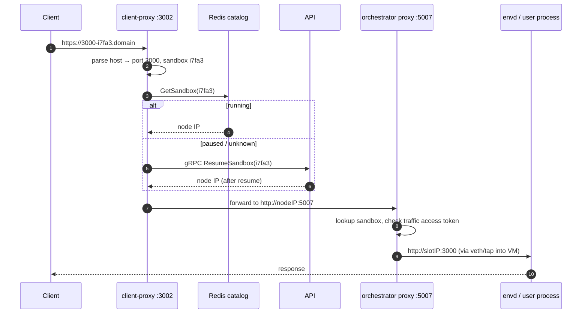
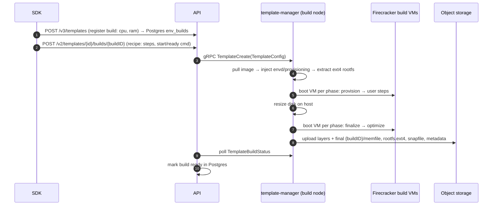
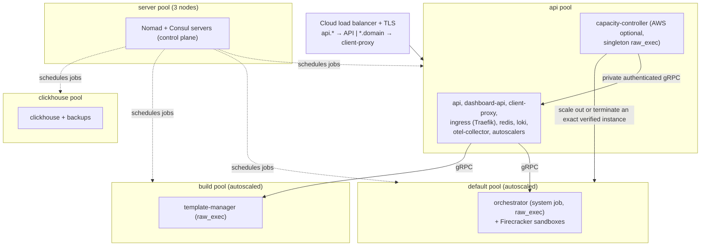

# E2B Infrastructure Architecture

This document explains what this repository implements, what each service does, and how the
services interact. It is the fastest way to build a mental model of the codebase before diving
into the code.

> **Keep this document updated.** If a code change alters anything described here (service
> responsibilities, ports, protocols, data stores, flows, deployment topology), update this file
> in the same PR.

## What this repository implements

E2B provides **sandboxes**: isolated Linux VMs that start almost instantly (they resume pre-booted
snapshots instead of cold-booting), run arbitrary code (typically
generated by AI agents), and can be paused, snapshotted, and resumed. This repo contains the whole
backend: the control-plane REST API, the data-plane VM orchestration built on
**Firecracker microVMs**, the in-VM agent, the edge routing layer, template building, and the
Terraform/Nomad infrastructure to deploy it all on GCP (AWS in beta).

Two ideas drive the design:

1. **A sandbox is a resumed snapshot.** Templates are pre-booted VM snapshots (memory + disk +
   VM state) stored in object storage. "Creating" a sandbox means restoring a snapshot, which is
   why startup is fast. Memory pages are loaded lazily on page-fault (userfaultfd) and the root
   filesystem is a copy-on-write overlay, so only touched data is ever fetched.
2. **Control plane and data plane are separate.** The API decides *where* a sandbox runs and
   tracks *that* it runs (Postgres/Redis); the orchestrator on each node owns *how* it runs
   (Firecracker, networking, storage). Sandbox traffic never passes through the API.

## System overview



## Services

| Service | Package | Runs on | Purpose |
|---|---|---|---|
| API | `packages/api` | API nodes | Public REST API; sandbox lifecycle, placement, auth, quotas |
| Orchestrator | `packages/orchestrator` | every sandbox node | Runs Firecracker VMs; sandbox create/pause/resume/kill |
| Template manager | `packages/orchestrator` (role) | build nodes | Builds templates from Docker images |
| Client proxy | `packages/client-proxy` | API nodes | Edge router: sandbox URL → correct node |
| Envd | `packages/envd` | inside every VM | In-VM agent: process/filesystem API for SDKs |
| Dashboard API | `packages/dashboard-api` | API nodes | Backend for the web dashboard (teams, builds, admin) |
| Capacity controller | `packages/capacity-controller` | one API node allocation (AWS, optional) | Reconciles client ASG desired capacity from de-duplicated workload and optionally makes verified-empty workers eligible for normal ASG scale-in |

Supporting packages: `packages/shared` (protos, telemetry, storage clients, feature flags),
`packages/auth` (authentication library), `packages/db` (Postgres migrations + sqlc queries),
`packages/clickhouse` (ClickHouse schema + clients), `packages/otel-collector` (collector config),
`packages/nomad-nodepool-apm` (autoscaler plugin), `packages/local-dev` (local stack).

### API (`packages/api`)

The control-plane entry point (Gin, OpenAPI-generated from `spec/openapi.yml`, port 80).

- **Resources**: sandboxes (create/list/kill/pause/resume/connect/timeout/metrics/logs),
  templates and builds, teams, volumes, API keys, secrets, admin operations.
- **Auth** (via `packages/auth`): team API keys (`X-API-Key`, `e2b_` prefix), auth-provider JWTs
  (OIDC), and either an admin token or a service JWT verified from the configured admin JWKS.
  Backed by an auth DB (Postgres) with a Redis team cache.
- **Workload identity**: sandbox create accepts an optional `iam.tokens` map of caller-named
  workload-token definitions (each an exact `audience` and `tokenType`). A non-empty, validated
  map enables workload identity, whose identity the orchestrator derives from the sandbox's
  already-authoritative team/sandbox/execution/template IDs; the definitions are passed to the
  orchestrator in `SandboxConfig.iam`. The API mints no credential and delivers nothing into the
  sandbox; file-based delivery is rejected at admission. Definitions are persisted in the
  running-sandbox (Redis) and paused-snapshot (Postgres) state so they survive pause/resume and
  orchestrator re-sync; a fork starts a new workload and does not inherit them.
- **Placement**: keeps a live map of orchestrator nodes (discovered via Nomad, Kubernetes, or a
  static list). Chooses a node per sandbox with a **best-of-K** algorithm
  (`internal/orchestrator/placement/`): sample K ready nodes, score by CPU
  commitment/usage, pick the lowest; retry on exhausted nodes. Before sending `Sandbox.Create`,
  each API replica atomically reserves one node-local create slot using the effective limit the
  worker advertises through `InfoService`. A full candidate is excluded from that placement round;
  if all compatible candidates are full, the request stays in the existing capacity wait under the
  same start-intent owner. This reservation is early backpressure, not a distributed quota: multiple
  API replicas can collectively exceed the advertised limit, so the worker remains the final
  admission authority. During an orchestrator-first rolling upgrade, a missing/zero advertised
  limit keeps legacy unbounded placement and records `legacy_unbounded` on the create span; the API
  never guesses a default. In `start-intent-v1`, the unique
  reservation owner writes an expiring, cluster-scoped intent after metadata validation and before
  the first placement attempt. The owner heartbeats that lease while placement waits for capacity.
  Success changes it to a short handoff lease until the running index is visible; failure,
  cancellation, and timeout remove it with a bounded context that does not inherit request
  cancellation. Duplicate requests join the existing reservation and never add demand. The
  explicit `dual-write` migration mode also maintains the legacy failure ledger, but the controller
  always reads exactly one configured source and never falls back automatically. The API derives
  its request, HTTP write, and graceful-shutdown deadlines from the configured capacity-wait budget;
  upstream proxies must have a longer timeout. Three consecutive Create RPCs returning
  `Unavailable` make that node unroutable in the observing API replica until a complete node sync
  succeeds; one transient failure does not remove capacity. An orchestrator guest-readiness timeout
  is returned as `DeadlineExceeded` with a machine-readable retry-safe detail only after its cleanup
  succeeds. Placement permits one additional node attempt (two total) without writing capacity
  demand. Cleanup failures and unknown create failures remain fail-closed.
  Tunable live via feature flags.
- **State**: writes sandbox records to Redis (source of truth for *running* sandboxes) and the
  sandbox→node **routing catalog** in Redis that client-proxy reads. Persistent entities
  (templates, builds, snapshots, teams) live in Postgres.
- **Workload-v2 capacity demand** (explicit opt-in): keeps one execution-fenced record per Sandbox
  in a Redis HASH and its expiry in a same-slot ZSET. Placement acquires a short `starting` lease and
  renews it while waiting. After the worker is ready, the API extends the lease to `EndTime`, promotes
  it to `running`, then persists the running record and routing catalog before notifying creation
  observers. Autoscaling reads only Redis `TIME + ZCOUNT`, so the hot path does not scan Sandbox
  payloads. Expired records stop counting immediately and a one-minute, 256-record bounded sweeper
  removes both indexes. `workload-v2-shadow` dual-writes while the legacy snapshot remains the sole
  ASG input; `workload-v2` reads only the ledger and fails explicitly on Redis errors. Neither mode
  falls back automatically. Kill, pause, expiry, and failed create remove the ledger only after
  worker/product cleanup is confirmed, so uncertain cleanup can temporarily overcount but cannot
  silently undercount live capacity.
- **Workload-v2 Redis shaping**: every Redis-backed workload mutation (`Acquire`, heartbeat renew,
  prepare, promote, deadline update, and remove) acquires a short-lived process-local permit. The
  final running/routing catalog write uses the same gate after the worker is ready. The independent
  `SANDBOX_WORKLOAD_COMMIT_CONCURRENCY` budget therefore bounds both admission/heartbeat bursts and
  the final commit without holding a permit during placement, EC2 scale-out, guest startup, or
  worker cleanup. Cancellation remains fail-closed, and the path adds no retry, timeout extension,
  or legacy fallback. Status and mutation-failure logs report the gate alongside Redis pool
  statistics.
- **Secrets**: `/secrets` is the only public surface for secret management (create, list, get,
  update, delete). The API authenticates the caller with the customer alternatives above, converts
  the authenticated team UUID to the project UUID the backend knows, checks the `customer-secrets`
  feature flag, and forwards a metadata-only request over a unary gRPC contract
  (`e2b.secretsstore.management.v1`) to the secrets store backend named by
  `SECRETS_STORE_BACKEND_GRPC_ADDRESS`. No caller credential, header or client-supplied tenant
  crosses that hop, and no response - here or in a log, a span or an error - carries a secret
  value. What a caller stores is a runtime marker, not a resolved secret; orchestrator-ee resolves
  a marker to a value at sandbox egress, never here. Without a configured address, or with the flag
  off, the routes stay registered and answer 403. Responses are `Cache-Control: no-store`, request bodies are capped at 512 KiB, and values
  at 64 KiB.
- **Rig passthrough**: admin endpoints under `/clusters/{clusterID}/rigs` manage a cluster's
  orchestrator node pools ("rigs"). They list rigs, change rig capacity, list and terminate
  instances, and read recent scaling errors. Every handler delegates to the cluster's edge service
  (`/v1/rigs/...`) through the per-cluster HTTP client that the cluster sync keeps fresh. The API
  holds no cloud credentials and makes no scaling decisions. The caller authenticates with an
  admin credential and never holds the cluster's edge secret. Edge status codes pass through unchanged
  (400, 404, 409, 501). An edge 401 becomes a 500: it means the API is misconfigured against the
  cluster, not that the caller's token is invalid. A cluster with no rig management configured
  returns an empty list. The local cluster has no edge deployment and answers 501 for every rig
  operation.
- **Extra listeners**: internal gRPC :5009 and edge gRPC :5109 expose `ResumeSandbox` so
  client-proxy can wake paused sandboxes on incoming traffic.
- Reads ClickHouse for sandbox/team metrics endpoints. Sandbox and template-build logs default to
  Loki, with a LaunchDarkly-gated ClickHouse read path for local-cluster logs during the log
  storage migration. LaunchDarkly feature flags also gate placement parameters, rate limits, and
  rollouts.

### Orchestrator (`packages/orchestrator`)

A single Go binary running on every sandbox node (as root). `ORCHESTRATOR_SERVICES` selects its
roles: `orchestrator` (run sandboxes) and/or `template-manager` (build templates). Code lives
under `pkg/`, almost all Linux-only.

gRPC services on :5008 (`pkg/server/`, `pkg/service/`, `pkg/template/server/`, `pkg/volumes/`):

- **SandboxService** — `Create`, `Update`, `List`, `Delete`, `Pause`, `Checkpoint`.
- **TemplateService** — `TemplateCreate`, `TemplateBuildStatus`, `TemplateBuildDelete` (template-manager role only).
- **InfoService** — node identity, roles, capacity, health status, and the worker's current effective
  concurrent Sandbox create limit (used by API node discovery and early create backpressure). New
  workers also advertise safe-scale-in support and one authoritative shutdown snapshot: live
  Sandboxes, admitted starts/resumes, lifecycle cleanups, snapshot uploads, and `shutdown_ready`.
- **ChunkService / VolumeService** — peer-to-peer template chunk serving; persistent volumes.

Key mechanisms (all under `pkg/sandbox/`):

- **Node admission**: AWS deployments with pending-demand autoscaling pin the orchestrator's
  running limit to the controller's `slots_per_node`. The concurrent-start limit defaults to the
  same value but can be lowered independently to protect node startup reliability without changing
  eventual capacity. An atomic in-flight reservation closes the race between the live sandbox
  count check and insertion into the running map, so concurrent creates cannot exceed that
  configured node limit. The Sandbox factory acquires this worker-side admission before any VM,
  network, or storage allocation and converts it into a tracked lifecycle before releasing it, so
  API creates, resumes, prefetch VMs, and template-build VMs share one drain fence. This admission
  is the final authority across all API replicas; API-side reservations only prevent avoidable
  request herding before the RPC reaches the worker.

  Safe scale-in changes the worker from Healthy to Draining under the same synchronization boundary
  used by create/resume admission. A request admitted first is included in the worker's in-flight
  count; a drain that wins first rejects the request before VM or network allocation with the
  structured retry-safe reason `NODE_DRAINING`. `shutdown_ready` becomes true only while Draining
  and when live Sandboxes, admitted starts/resumes, lifecycle cleanups, and snapshot uploads are all
  zero. Missing capability fields and contradictory counts fail closed.

- **Firecracker** (`fc/`): each sandbox is one Firecracker process in its own cgroup and network
  namespace. The FC HTTP API (unix socket) configures machine, drives, network, and snapshots.
  Guest metadata (sandbox ID, envd access token hash) is passed via MMDS.
- **Lazy memory / UFFD** (`uffd/`): on resume, Firecracker restores the VM without loading
  memory; a userfaultfd handler serves page faults directly from the template's memfile, so only
  touched pages are read. An optional prefetcher warms known-hot pages.
- **Copy-on-write rootfs** (`rootfs/`, `nbd/`, `block/`): the template rootfs stays read-only;
  writes go to a per-sandbox COW cache exposed to Firecracker as an NBD block device served by
  an in-process userspace NBD server. On pause, the dirty blocks are exported as a diff.
- **Template cache** (`template/`): templates are fetched lazily from object storage and cached
  on local disk (and optionally on a shared NFS chunk cache, or fetched peer-to-peer from other
  nodes before upload completes).
- **Networking** (`network/`): each sandbox gets a slot — a network namespace with a veth pair
  and a tap device, unique host-side IP (from a /16), NAT, and per-slot nftables egress firewall
  (with SNI/Host-inspecting TCP firewall for domain allow/deny lists). Slots are pooled and
  reused; slot indexes are allocated locally against the node's netns state (leftover
  namespaces from a previous run are torn down by startup reclaim).
- **Sandbox proxy** (:5007, `pkg/proxy/`): reverse-proxies incoming traffic from client-proxy to
  the sandbox's slot IP and requested port over HTTP or configured HTTPS, enforcing per-sandbox
  traffic access tokens. HTTPS backends may use self-signed certificates.
- Writes sandbox lifecycle **events** and cgroup **host stats** to ClickHouse; exports metrics via
  OTel. Sandbox and template-build log writes go through a flag-resolved HTTP route: the legacy
  collector remains the fallback primary destination, and configured shadow destinations can mirror
  writes during collector/storage migrations without changing sandbox behavior.

### Envd (`packages/envd`)

The agent inside every VM (started by systemd very early in boot), port 49983, chi + Connect RPC.

- **Process service** (`spec/process/process.proto`): start/list/connect to processes, stream
  stdout/stderr, stdin, signals, PTYs — this is what SDKs use to "run code".
- **Filesystem service** (`spec/filesystem/filesystem.proto`): stat/list/make/move/remove/watch.
- **REST**: `/health`, `/metrics`, `/envs`, `/files` upload/download, `/init` (orchestrator pushes
  env vars, access token, metadata after boot/resume), `/upgrade` (live self-upgrade, below),
  freeze/thaw hooks used during pause.
- **Public vs. control-plane routes**: the control routes (`/init`, `/upgrade`, and the freeze/thaw
  hooks) are marked `x-internal: true` in `spec/envd.yaml`, and `/upgrade` — which the spec does not
  describe — is listed alongside them in the orchestrator's `pkg/sandbox/envd`. The orchestrator
  reaches them over the host network at the sandbox slot IP; the sandbox proxy refuses them with a
  404, for every method, so they are not reachable through a sandbox URL. Adding a control route
  therefore means marking it in the spec (`go generate` carries the marker into the proxy's
  rejection list) — otherwise it ships reachable from the internet.
- **Auth**: `X-Access-Token` header checked against a token delivered via Firecracker MMDS;
  signed URLs for file endpoints. `/init` is exempt (it is what *delivers* the token), which is the
  main reason the proxy refuses it outright.
- **Live upgrade** (`internal/services/process/upgrade.go`): an authenticated `POST /upgrade` lets
  the orchestrator swap envd inside a *running* sandbox at resume. It streams the new binary in the
  request body and envd `syscall.Exec`s into it **with the same PID**, carrying the workload's
  stdio/PTY fds, process table, recently-retained exit codes and filesystem watchers forward via a
  tmpfs handover blob. The workload cgroups stay frozen until the post-upgrade `/init` restores the
  access token (so no re-adopted process runs unauthenticated), and the handover outcome
  (procs/watchers re-adopted, plus any failures) rides back on that `/init`'s `X-Envd-Handover`
  header for fleet visibility.
- Scans guest ports and forwards them so any port a user process opens becomes reachable through
  sandbox URLs. **`pkg/version.go` must be bumped on every behavioral change** — the API and the
  orchestrator gate features on the envd version recorded in each template build.

### Client proxy (`packages/client-proxy`)

The stateless edge for all sandbox traffic (port 3002; health on 3003). Terminates
`https://<port>-<sandboxID>.<domain>` requests (host parsing in `packages/shared/pkg/proxy/host.go`),
looks the sandbox up in the Redis routing catalog to find the owning node, and reverse-proxies to
that node's orchestrator proxy on :5007. If the sandbox is not in the catalog (paused), it calls
the API's `ResumeSandbox` gRPC and retries — paused sandboxes wake transparently on traffic.

### Dashboard API (`packages/dashboard-api`)

A separate REST service (port 3010, spec `spec/openapi-dashboard.yml`) consumed by the web
dashboard, not the SDK: legacy team management/provisioning, template tags, build listings, admin
bootstrap. Its admin routes accept either a shared admin token or a short-lived service JWT
verified against the configured admin JWKS. The `disable-legacy-team-mutations` LaunchDarkly flag
rejects legacy lifecycle writes with 412 after authentication; it leaves reads and the workspace
API's management projection writes available. Team-scoped template and build read routes accept either dashboard user auth or
team API key auth (`X-API-Key`). Its workspace-agnostic `/v1/management` operations are defined in the
same dashboard OpenAPI contract and registered on the existing router. Their `AdminJWTAuth`
OpenAPI security scheme accepts only short-lived service JWTs verified against the workspace-api
`/.well-known/jwks.json` endpoint, with accepted signing methods derived from each JWK's required
`alg` metadata. Issuers and audiences are configured through the JSON `ADMIN_AUTH_PROVIDER_CONFIG` value —
the same config shape as `AUTH_PROVIDER_CONFIG`. Talks to Postgres and ClickHouse; never talks to
orchestrators.

An issuer normally configures at least one accepted audience, binding a JWT to its intended target.
An issuer may omit `audiences` only with no `audienceMatchPolicy`; this deliberately disables
audience matching while issuer, signature, and temporal-claim verification remain required.

The `/v1/management` operations are the cluster's half of a contract the workspace residency owns:
project upsert (a project is a `public.teams` row created from a caller-supplied UUID; the tier is
assigned once at creation from a local default and no push moves it; a changed slug renames the project, and nothing else follows it), per-member projection,
and limit sync (into `project_limits`, which `team_limits` reads in preference to `tiers`). All are
idempotent, because the caller is level-triggered and retries. `PUT
/v1/management/projects/{projectID}/members/{userID}` applies the desired presence for one user,
gated by a monotonic per-project/user revision stored in `projection.project_members`; duplicate or
older revisions succeed without changing target state. `PUT
/v1/management/projects/{projectID}/limits` is gated the same way, by a monotonic per-project
revision in `projection.project_limits`: the caller raises it whenever the limits it resolved for a
project change, and a delivery at or below the recorded revision is dropped and still answers 204.
The ledger and the values in `public.project_limits` advance in one transaction, so a revision is
never recorded without the values it admitted. Both fences are the target's, and both exist for the
same reason — the caller can only fence what it sends, so two deliveries in flight arrive in
whichever order the network gives them and the older one has to be refused where it lands. A present projection includes that User's
OIDC issuer/subject identities. Every projected user has at least one identity, and an identity
already owned by a different user returns 409. A revocation removes only that User's
`users_teams` row; projected Users and identities are retained. Membership writes live in
`internal/management` with their post-commit cache eviction rather than in the handlers: auth
caches member authorization, so each accepted command invalidates that User's authorization for
the Project after commit.

The management surface also owns a replay-safe cluster lifecycle. A caller registers a stable
cluster UUID with immutable connection details, assigns it only to the named project, detaches that
exact assignment before provider cleanup, and deletes the cluster only after no project references
it. Replaying the same registration or assignment succeeds, while a changed descriptor, a different
assignment, an inexact detach, or deletion of a referenced cluster returns a conflict.

`DELETE /v1/management/projects/{teamID}` is declared and answers 501. `envs`, `snapshots` and
`volumes` reference `teams` with `ON DELETE NO ACTION` and templates are only soft-deleted, so a
project that ever built one pins its team row — and releasing it needs the API service's
orchestrator connections, which this service does not have. Projects are not deleted from control
planes today.

## Data stores

| Store | Owner packages | What lives there |
|---|---|---|
| **PostgreSQL** | `packages/db` (goose migrations, sqlc) | Durable control-plane state: `teams`, `users`, `tiers` (quota defaults), `project_limits` (per-team quota overrides pushed in by the owning service; the `team_limits` view reads it in preference to `tiers`), `envs` (templates), `env_builds` (build rows: vcpu, ram_mb, status, versions), `env_aliases`, `snapshots` (paused sandboxes), `team_api_keys`, `volumes`, `clusters` |
| **Redis** | API, client-proxy, orchestrator | Ephemeral runtime state: running-sandbox store (source of truth), sandbox→node routing catalog, team/template/snapshot caches, rate limiting, P2P chunk peer registry, versioned start-intent leases, and the isolated legacy demand namespace retained for explicit rollback |
| **ClickHouse** | `packages/clickhouse` | Time-series/analytics: `metrics_gauge`/`metrics_sum` (written by the OTel collector), `sandbox_events`, `sandbox_host_stats` (written by orchestrator), team metrics, and optionally `sandbox_logs` during the log migration. Read by API and dashboard-api |
| **Object storage** (GCS/S3/local, `packages/shared/pkg/storage`) | orchestrator, template-manager | Template & snapshot artifacts, keyed by build ID: `{buildID}/memfile`, `{buildID}/rootfs.ext4`, `{buildID}/snapfile`, `{buildID}/metadata.json` + `.header` index files |

A template and a paused-sandbox snapshot have the **same artifact shape** — a snapshot is just a
new build whose memfile/rootfs are stored as diffs against the template it came from (diff chains
are resolved through the `.header` files).

## Core flows

### Sandbox creation

```mermaid
sequenceDiagram
    autonumber
    participant C as SDK
    participant API as API
    participant R as Redis
    participant CC as Capacity controller (AWS, optional)
    participant ASG as Client-node ASG
    participant O as Orchestrator (chosen node)
    participant FC as Firecracker
    participant E as envd (in VM)

    C->>API: POST /sandboxes {templateID}
    API->>API: auth team, resolve template alias → ready build (Postgres/cache)
    API->>R: reservation owner upserts expiring start intent
    CC->>API: internal gRPC snapshot (independent bearer)
    API->>R: read running IDs and active intent IDs
    API-->>CC: cardinality(running UNION intents)
    CC->>ASG: target=max(desired, ceil(workload/slots))
    API->>API: best-of-K placement; refresh nodes and retry on capacity errors
    ASG-->>API: new orchestrators become discoverable through Nomad
    API->>API: pick node
    API->>O: gRPC SandboxService.Create(SandboxConfig)
    O->>O: fetch template (local cache / NFS / object storage)
    O->>O: acquire network slot + NBD rootfs overlay + uffd memory
    O->>FC: load snapshot, resume VM
    O->>E: POST /init (env vars, access token) — retried until ready
    E-->>O: 204
    O-->>API: Create OK
    API->>API: workload-v2 waits for a bounded commit permit
    API->>R: intent outstanding -> handoff; prepare/promote workload
    API->>R: store running sandbox + routing catalog; remove owned handoff
    API-->>C: 201 sandbox {sandboxID, domain}
```

The API blocks on the gRPC `Create`, which itself blocks on envd's `/init` — when the client
gets a response, the sandbox is fully usable. Fresh creates are internally a *resume* of the
template's base snapshot (cold boots happen for filesystem-only templates and builds, or when
an explicit resume requests one — see pause and resume below; template creates never do).
If the transport returns `Unavailable` three times consecutively, the API locally quarantines that
node until a successful full sync proves recovery. If envd never becomes ready, the orchestrator
returns `DeadlineExceeded` with an exact retry-safe detail only after cleanup succeeds; placement
may try one other node, for at most two guest-readiness attempts, without creating autoscaler
demand. Cleanup failures are terminal. Firecracker exits, template errors, and unknown failures
retain their existing hard-failure behavior.

The capacity controller never treats the cached worker summary as termination proof. Its private
API flow binds every Begin/Verify/Cancel request to both the node ID and the worker process's service
instance ID. Verify combines a fresh InfoService snapshot with a live `Sandbox.List`; an identity
change, stale or unsupported worker, non-empty list, or read failure preserves the host.

Redis connection capacity and connection establishment are configured separately. `REDIS_POOL_SIZE`
sets the steady-state command pool, while optional `REDIS_MAX_CONCURRENT_DIALS` limits simultaneous
TCP/TLS handshakes for both standalone and cluster clients. Leaving the dial limit at zero preserves
the go-redis default. Workload modes reject a non-positive commit budget, a commit budget larger than
the pool, and a positive dial limit larger than the pool at startup instead of silently changing it.

### Sandbox traffic



### Volume content

Persistent volumes (`packages/orchestrator/pkg/volumes/`) are managed through the control-plane
API (`POST/GET /volumes`), but their **content** — reading and writing files — is served by a
separate volume-content API (belt, `e2b-dev/belt`) that the SDK talks to directly, not through the
control-plane API. The API's role is to mint the credential and tell the SDK where to send content
traffic.

```mermaid
sequenceDiagram
    autonumber
    participant U as SDK
    participant API as API
    participant PG as PostgreSQL
    participant VC as volume-content API (belt)

    U->>API: POST /volumes (create) or GET /volumes/{id}
    API->>PG: persist / load volume row
    API->>API: mint JWT (aud = https://api.&lt;domain&gt;)<br/>resolve domain
    API-->>U: { volumeID, name, token, domain? }
    Note over U: domain is returned only for BYOC teams;<br/>SDK stores it and falls back to api.&lt;E2B_DOMAIN&gt; otherwise
    U->>VC: /volumecontent/{id}/... at api.&lt;domain&gt;<br/>Authorization: Bearer token
    VC->>VC: verify token (audience must match its own origin)
    VC-->>U: file content
```

- **Domain selection.** The token's audience and the content host are the same origin,
  `https://api.<domain>`. For teams on a **custom (BYOC) cluster** (`team.ClusterID` set), the API
  returns that cluster's domain (`cluster.SandboxDomain`, resolved in
  `handlers.volumeContentDomain`) so content traffic goes to the BYOC cluster's edge instead of the
  control-plane host. For teams on the default cluster the response omits `domain` and the SDK uses
  its configured default (`api.<E2B_DOMAIN>`); the audience then uses the deployment's `DOMAIN_NAME`.
- **Token.** A short-lived JWT (`handlers.generateVolumeContentToken`, config in
  `cfg.VolumesTokenConfig`) signed by the API, scoped to the team and volume, presented as a bearer
  token on every content request. Its `aud` claim is `https://api.<domain>`, so a token minted for
  one cluster's origin is not accepted by another.

### Pause and resume

- **Pause**: API records a snapshot row in Postgres, then gRPC `Pause` to the node. The
  orchestrator pauses the VM, snapshots it, diffs memory (dirty-page tracking) and rootfs (COW
  cache) against the template, caches the snapshot locally, and uploads asynchronously to object
  storage (with a retry budget). The sandbox leaves the Redis catalog.
  - **Deferred rootfs export** (gated by the `deferred-rootfs-export` flag in
    `packages/shared/pkg/featureflags`): instead of diffing the rootfs on the pause critical
    path, the orchestrator ejects the writable COW cache during pause and returns, then seals it
    into the rootfs diff (reflink) in the background. This moves the rootfs-diff latency off the
    pause, but the local snapshot's rootfs body isn't materialized until the seal finishes, so the
    async upload — and any origin-node resume/prefetch that reads the rootfs diff — waits on the
    seal. A seal failure is permanent (it never re-runs), so the upload fails fast rather than
    retrying.
- **Resume**: same path as creation, but placement prefers the **origin node** — if the snapshot
  is still in its local cache, resume avoids any object-storage reads. `Checkpoint` is a
  pause+resume in place used to persist state while keeping the sandbox running.
- **Explicit filesystem-only resume**: `memory: false` on resume/connect demands a cold boot
  (`RebootSandbox`) even when the snapshot includes memory, as a self-serve rescue when the
  restored memory state is unusable. Gated per team by the `fs-only-resume-api` flag; when off
  the request is rejected with an explicit error, never silently downgraded to a memory restore.
  The disk has crash-recovery semantics (unflushed pre-pause writes are lost), nothing durable
  is mutated (the memory snapshot survives untouched), and auto-resume never takes this path —
  traffic always memory-resumes.
- **Pre-boot filesystem recovery**: every cold boot of a rootfs that was not frozen at pause
  (`fs_quiesced` false/absent) runs a jailed `e2fsck -p -E journal_only` before the VM starts —
  journal replay only, the same recovery the guest kernel would do at mount — so a `memory: false`
  rescue and a legacy sync-fallback filesystem-only snapshot both mount a consistent disk. It
  replays and exits without a full consistency scan, so the cost is bounded by journal content,
  not filesystem size. Runs under the same confinement as the offline envd swap (unprivileged
  transient unit, device access pinned to the sandbox's own NBD node). A clean replay boots;
  anything else fails the start with the snapshot untouched but stays retryable. Journal replay
  never condemns a snapshot: its exit codes cannot tell an unmountable filesystem apart from a
  transient device fault, so every non-replayed outcome — an operational failure (timeout, I/O,
  device error) or an e2fsck exit that is not a clean replay — is retryable, never a permanent
  customer-facing verdict. In-file corruption that still mounts is likewise not condemned — replay
  does not scan, so it boots. Whole-filesystem repair and condemning a rootfs are left to a
  separate opt-in full-filesystem repair path. Gated by the `preboot-fs-recovery` flag, separate
  from `fs-only-resume-api` because it also changes the behavior of existing filesystem-only cold
  boots.
- **Envd live-upgrade on resume**: the orchestrator can upgrade the sandbox's envd to a newer
  node-local build during resume (gated by the `envd-upgrade-target` flag in
  `packages/shared/pkg/featureflags`), via envd's `POST /upgrade` (see the envd section). It is
  best-effort — a delivery failure before the `exec` leaves the old envd serving — except an
  unrecoverable post-`exec` failure (the new envd never re-initializes), which fails the resume
  rather than return a permanently unusable sandbox.
- **Envd offline-upgrade on cold-boot resume**: reaches envd too old for the live `/upgrade`
  handover (below `MinEnvdVersionForUpgrade`). When a *filesystem-only* snapshot cold-boots
  (`RebootSandbox`), the orchestrator rewrites `/usr/bin/envd` in the rootfs **before** the VM
  boots (`PreBootFn` → `pkg/sandbox/rootfs.SwapEnvdBinary`), entirely in userspace via a jailed
  `debugfs` — never a host-kernel mount of the tenant image. The old envd never participates, so
  the method is version-agnostic. Gated by the `envd-offline-upgrade-target` flag (a sibling of
  `envd-upgrade-target` sharing the same version-remap resolver), and applied only when the
  snapshot's rootfs was captured frozen (`fs_quiesced`, so it is crash-consistent); best-effort
  (a swap failure boots the original envd). Because the swap keys on the snapshot's *built-with*
  version, which it does not advance, it re-fires idempotently on each cold-boot resume until a
  re-pause re-bakes the running version.
- Auto-pause/auto-resume make sandboxes effectively serverless: idle sandboxes pause, traffic
  resumes them (see traffic flow above).

### Template build



Builds are **layered** (`pkg/template/build/phases/`): base → user → one layer per recipe step →
resize disk → finalize → optimize. Each layer is hashed and cached, so rebuilds only re-run changed
steps. Resize disk grows the quiescent rootfs on the host; the other non-cached phases run in a real
Firecracker VM and their pause-diffs become layers. The optimize phase records which memory pages a
fresh resume touches, producing prefetch hints that speed up future sandbox starts.

## Deployment topology

Deployed with **Terraform** (`iac/provider-gcp/`, `iac/provider-aws/`) onto a **Nomad + Consul**
cluster. Nomad job specs live in `iac/modules/job-*/jobs/*.hcl`.



- **Server nodes** run only Nomad/Consul servers (scheduling, service discovery, Consul DNS —
  services address each other as `*.service.consul`).
- **API nodes** host every control-plane container and are the only LB backend.
- **AWS capacity controller** is an optional singleton on the API node pool. In
  `start-intent-v1` it calls the API's internal gRPC service through Consul DNS with an independent
  bearer credential; this service is not registered on edge gRPC and returns only aggregate counts.
  The API strictly reads running records and active intent leases for the requested cluster, unions
  their Sandbox IDs, and fails the snapshot instead of silently undercounting a corrupt or
  unavailable authority. The controller computes
  `max(currentDesired, ceil(workloadCount / slotsPerNode))`, clamps it to explicit min/max, and only
  raises the named client ASG. Snapshot errors produce no ASG write and no automatic legacy
  fallback. Ready Nomad count is diagnostic: already-requested but not-ready EC2 capacity is covered
  by ASG desired and is not requested twice.

  Safe scale-in is a separate `off` (default), `observe`, or `enforce` path available only with
  `start-intent-v1`. It retains configured headroom above current workload, waits for a stable
  surplus, and selects protocol-capable low-occupancy workers older than the minimum EC2 instance
  age. Candidate occupancy includes running Sandboxes, worker-observed starts, and API placements
  already in progress; the final worker read remains authoritative. Empty workers may use the
  global 50-operation window; non-empty workers also consume a 10% graceful-drain budget while
  their Sandboxes end naturally. A steady reconciliation shares one fresh Nomad, Worker, and full
  ASG observation across compensation and scale-in planning; observations are never reused across
  reconciliations, and safety-critical post-write checks still read fresh state. The lightweight
  desired-capacity read excludes ASG instance details. Scale-in never migrates or kills a Sandbox.

  New sandbox-client ASG instances start with scale-in protection. A protected instance cannot be
  selected by normal ASG scale-in. The controller writes an owned Nomad drain marker and asks the
  exact worker service instance to enter Draining under a stable operation ID. Discovery carries
  the full Nomad node UUID separately from the legacy shortened routing key, so a replacement
  registration on the same EC2 instance cannot inherit an older operation. The Worker admission
  lock makes Begin idempotent for the same operation and rejects a competing owner. While Draining,
  the worker rejects new create/resume admissions. `shutdown_ready` requires live Sandboxes,
  starts/resumes, lifecycle cleanup, and snapshot uploads all to be zero; the API also verifies a
  fresh `Sandbox.List` is empty.

  Only an owned Draining worker that passes fresh workload, Nomad, Worker, ASG membership, health,
  lifecycle, instance-refresh, identity, and emptiness checks may have protection removed. Such an
  unprotected safe worker is called **armed**: ASG may select it for normal scale-in, but the worker
  remains Draining and Nomad-ineligible. Ordinary, busy, unknown, unhealthy, or identity-mismatched
  instances remain protected. One reconciliation may open the full global window of 50 empty
  workers, so the subsequent absolute desired-capacity write can consume one complete safe batch
  instead of fragmenting it into smaller ASG convergence cycles. Protection does not prevent
  health-check replacement, Spot interruption, or manual termination; those remain separate
  failure paths.

  The controller lowers capacity only when the ASG is **settled**: member count equals desired
  capacity, every member is `InService`, and no active refresh or previous termination is in
  progress. It verifies that every unprotected member is armed, then writes one absolute target:
  `desired - min(armed, desired-safeRequired, 50)`. While membership differs from desired, it waits
  for that batch to converge before considering another. Because each reconciliation derives an
  absolute target from current AWS state, a restart or an ambiguous response is recovered by a
  fresh read rather than by repeating a relative decrement.

  Demand growth always takes priority. The controller stops opening drains and, when membership is
  above desired, first raises desired to at least the current member count and safe requirement.
  It then re-protects surviving `InService` workers, confirms protection from a fresh ASG snapshot,
  restores the matching Worker operation, and finally restores Nomad eligibility. A worker already
  in `Terminating*` is never reopened; scale-out replaces that capacity. Unknown or contradictory
  state fails closed by preserving or restoring protection and stopping scale-in, without blocking
  scale-out.

  Safe rollback follows the same ordering: raise desired to at least current membership, wait until
  there is no pending normal scale-in deficit, protect every remaining instance, cancel owned
  Worker drains, restore Nomad eligibility, and only then disable enforce mode or roll back the
  controller. The controller has no listener or public route. Its enforce-only
  `autoscaling:SetInstanceProtection` and existing `autoscaling:SetDesiredCapacity` permissions are
  resource-scoped to the named client ASG; ASG/EC2 Describe calls remain read-only. The controller
  currently shares the API-node instance role and Nomad cluster token with other colocated jobs;
  process-specific cloud/Nomad identity would require a separate workload-identity mechanism and
  is not claimed by this deployment.
  The legacy failure-ledger reader remains isolated for explicit operational rollback until the
  migration observation period is complete.
- **Sandbox ("client") nodes** run the orchestrator as a Nomad *system* job via `raw_exec`
  (it needs root for Firecracker, namespaces, NBD, cgroups). Configured with hugepages and local
  template caches. Autoscaled.
- **Build nodes** run the same binary in template-manager mode; the `nomad-nodepool-apm`
  autoscaler plugin scales the job with the node pool.
- PostgreSQL is external (connection string via secrets); Redis runs as a Nomad job or as a
  managed service; ClickHouse runs on its own pool.
- Observability: everything exports OTel; the collector fans out to ClickHouse (product metrics)
  and Grafana Cloud/stack. Logs default to the legacy Vector → Loki path; dynamic log routing can
  select a primary collector and shadow collectors, and local-cluster log reads can be switched to
  ClickHouse with `logs-read-config` after `sandbox_logs` is populated.

## Repository layout

```
packages/
  api/                  Control-plane REST API
  orchestrator/         Sandbox runtime + template builder (one binary, per-node)
  client-proxy/         Edge router for sandbox traffic
  envd/                 In-VM agent (bump pkg/version.go on behavior change!)
  dashboard-api/        Web-dashboard backend
  capacity-controller/  Optional AWS client-ASG scale-out and verified-empty scale-in controller
  shared/               Protos, telemetry, storage clients, proxy engine, feature flags
  auth/                 AuthN library (API keys, JWT/OIDC) used by api + dashboard-api
  db/                   Postgres migrations (goose) + queries (sqlc)
  clickhouse/           ClickHouse schema, batching writers, query clients
  otel-collector/       Collector config
  nomad-nodepool-apm/   Nomad autoscaler metric and deployment-aware target plugins
  local-dev/            docker-compose local stack + DB seeding
spec/                   OpenAPI specs (public, edge, dashboard) — codegen sources
iac/                    Terraform + Nomad jobs (provider-gcp, provider-aws, shared modules)
tests/integration/      Integration tests against a live deployment
```

Cross-service contracts are all generated: OpenAPI specs in `spec/`, gRPC protos in
`packages/orchestrator/*.proto` and `packages/envd/spec/`, SQL in `packages/db/queries/`.
Run `make generate` after changing any of them.
